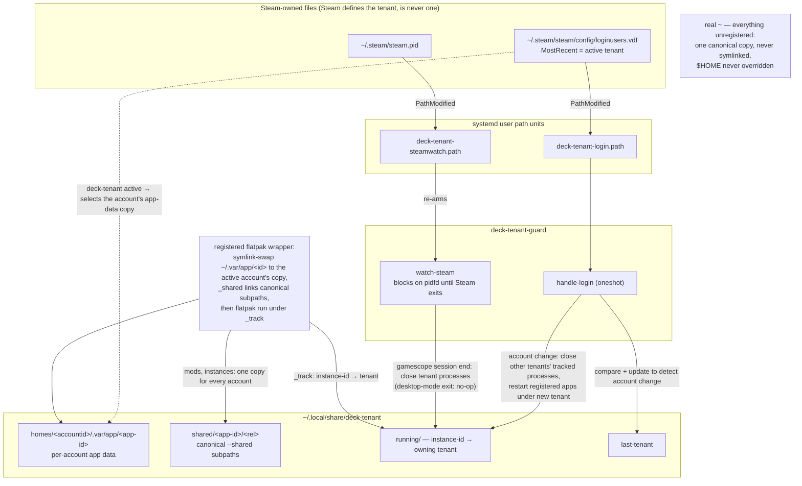

# deck-tenant

**Per-app, per-Steam-account** data isolation for non-Steam apps on
Steam Deck / SteamOS.

Every Steam profile on a Deck runs as the one `deck` Linux user, so Discord,
Kodi, browsers, and emulators share a single login and state between family
members. SteamOS isolates only Steam's own per-account data — nothing else.
No existing tool fills this gap (Steam-account *switchers* exist; app-data
tenancy does not).

deck-tenant isolates exactly the apps that need it. A registered flatpak app
has its **entire `~/.var/app/<id>` symlink-swapped** to the active Steam
account's copy — complete state isolation (config, cache, data) with zero
app-internal path knowledge. `$HOME` is **never** overridden and nothing
outside the registered app dirs is symlinked: everything else on the device
(game installs, mods, ROM libraries, emulator state) has one canonical copy
by construction. Subpaths *inside* a registered app's dir that must stay
canonical across accounts — mod folders, game instances — are declared with
`--shared` at registration and symlink to one shared copy.

A full `$HOME` override was rejected by design: it SIGTRAPs zypak/Electron
flatpaks like Discord, whose portal-spawned children resolve paths from the
real home — and it silently forks anything ever launched under it (the mods
problem). Session plumbing (D-Bus, Wayland, PipeWire, portals) lives in
`$XDG_RUNTIME_DIR`, independent of all this, so display, audio, and keyring
integration are unaffected. The desktop session itself is never touched, and
Steam is explicitly refused tenancy: it is the application that *defines*
the active tenant (`loginusers.vdf` `MostRecent`).

## Install

Prebuilt packages come from the [`[mason]` pacman
repo](https://github.com/MasonRhodesDev/arch-repo). SteamOS is Arch-based, so
the Arch package is the **only** packaging target — there is deliberately no
RPM spec / COPR for this repo.

### Steam Deck / SteamOS (user-level pacman root, no sudo)

SteamOS's root filesystem is read-only and wiped on updates, so install into
a user-level pacman root (`~/.local/share/deck-pkgs`) — survives SteamOS
updates, and pacman gives real install/upgrade/uninstall with file tracking:

```sh
# one-time: a pacman config pointing at the [mason] repo and the user root
ROOT=~/.local/share/deck-pkgs
mkdir -p $ROOT/var/lib/pacman $ROOT/var/cache/pacman/pkg ~/.config/deck-pkgs
cat > ~/.config/deck-pkgs/pacman.conf <<EOF
[options]
Architecture = auto
CacheDir = $ROOT/var/cache/pacman/pkg

[mason]
SigLevel = Optional TrustAll
Server = https://masonrhodesdev.github.io/arch-repo/x86_64
EOF

# install / upgrade (same command; pacman needs euid 0 → rootless userns).
# bash/python are host-provided on SteamOS but absent from this pacman root's
# db, so pacman must be told to assume them.
unshare -r pacman --config ~/.config/deck-pkgs/pacman.conf \
    --root $ROOT --dbpath $ROOT/var/lib/pacman \
    --assume-installed bash --assume-installed python \
    -Sy deck-tenant

# one-time per-user wiring: PATH snippet, guard units linked+enabled, and
# ExecStart drop-in overrides pointing the canonical units at this root
$ROOT/usr/bin/deck-tenant setup

# uninstall
unshare -r pacman --config ~/.config/deck-pkgs/pacman.conf \
    --root $ROOT --dbpath $ROOT/var/lib/pacman -R deck-tenant
```

### Arch Linux (regular system install)

Add the repo to `/etc/pacman.conf`:

```ini
[mason]
SigLevel = Optional TrustAll
Server = https://masonrhodesdev.github.io/arch-repo/x86_64
```

```sh
sudo pacman -Sy deck-tenant
deck-tenant setup   # enables the per-user guard units
```

## Use

**Shared is the default; isolation is a per-app opt-in.** Register only apps
where per-account state actually matters (logins, DMs — e.g. Discord).
Everything unregistered runs against the one real home, so mods, libraries,
and config stay canonical for free. Don't register an app "just in case" —
each registration adds a wrapper, a guard entry, and a per-account fork of
the app's whole data dir.

```sh
# make an app per-account: launch wrapper + desktop-entry/URI shadow + guard
deck-tenant register --app-id com.discordapp.Discord --name Discord

# per-account app whose mods/instances must stay canonical: declare them
# --shared — those subpaths symlink to ONE copy shared by every account
deck-tenant register --app-id org.prismlauncher.PrismLauncher --name Minecraft \
    --shared data/PrismLauncher/instances

# ensure every Steam profile has a shortcut launching the wrapper (Steam closed)
deck-tenant-steam-sync

# what's running, and which tenant owns it
deck-tenant ps
```

## Pieces

Everything hangs off two Steam-owned files — no daemon, just path units:



- **`deck-tenant`** — tenant detection (`active`), `register`/`unregister`,
  `list`. Per-account app data lives at
  `~/.local/share/deck-tenant/homes/<accountid>/.var/app/<app-id>`; the
  wrapper swaps `~/.var/app/<app-id>` to the active account's copy at launch.
- **`--shared` subpaths** — per-app canonical dirs inside a registered app's
  data dir (declared at registration, stored in `apps.tsv` col 4). The
  wrapper calls `deck-tenant _shared` before every launch, which symlinks
  each subpath to the one copy under
  `~/.local/share/deck-tenant/shared/<app-id>/`. The first account that
  brings real data at a shared subpath seeds the canonical copy; a later
  account's own copy is set aside as `<path>.local`, never merged or lost.
- **Process tracking** — every launch is ownership-tagged: flatpak instances
  are recorded (instance-id → tenant) by `deck-tenant _track`. `deck-tenant
  ps` lists them; the guard kills precisely by owner.
- **`deck-tenant-guard`** — fully event-driven, no daemon and no polling:
  a systemd path unit on `loginusers.vdf` delivers account changes
  (`handle-login`), and a path unit on `steam.pid` re-arms a watcher that
  blocks on a **pidfd** until Steam exits (`watch-steam` — kernel event, zero
  CPU). Gamescope session end closes all tenant-owned processes; an account
  change closes other tenants' processes and restarts registered apps under
  the new tenant; a desktop-mode Steam exit leaves everything alone.
- **`deck-tenant-steam-sync`** — byte-exact `shortcuts.vdf` editor: rewires
  direct-launch entries to the tenant wrapper (preserving appids/artwork) and
  creates missing ones so every profile can launch — and first-time
  sign-in to — each registered app. Also syncs grid artwork from a canonical
  store at `~/.config/deck-tenant/art/<appname>/{grid,poster,hero,logo,icon}.<ext>`
  into every profile's `config/grid/`, keyed to each shortcut's *current*
  appid — artwork survives appid churn (a shortcut re-added through Steam's
  UI gets a fresh appid, orphaning appid-keyed art) and lands automatically
  on newly linked accounts. Works for any shortcut with a matching art dir,
  registered or not. `--art-only` skips all `shortcuts.vdf` writes and is
  safe to run while Steam is up (grid files can be added live).

## Notes

- Per-account state lives in `~/.local/share/deck-tenant/homes/<accountid>`,
  canonical `--shared` copies in `~/.local/share/deck-tenant/shared/<app-id>`.
  Everything is user-level; SteamOS updates never touch it.
- Registered wrappers kill an instance left by another tenant before
  launching (single-instance apps would otherwise focus the previous
  tenant's session).
- With no Steam login (fresh device), the tenant is `default`.
